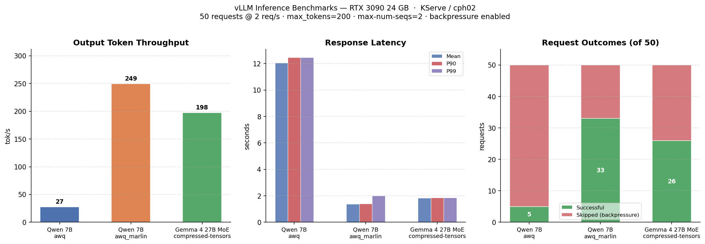

# LLM Inference Benchmarks — KServe / vLLM on cph02

Benchmarks run against the OpenAI-compatible vLLM endpoint at `https://llm.cph02.nicklasfrahm.dev`.

Each benchmark sends **50 chat completion requests** at **2 req/s**, with each prompt requesting up to 200 completion tokens.

**Backpressure**: All runs use `--enable-server-load-tracking` + a `BackpressureMiddleware` on the server (returns HTTP 503 immediately when `server_load_metrics >= max_num_seqs`) and a client-side `/load` check (`--max-concurrent=4`). Requests are skipped at zero cost rather than queuing indefinitely.

---

## System Specifications

| Component | Details |
|-----------|---------|
| Node | `deer` (Talos v1.12.6, kernel 6.18.18-talos) |
| GPU | NVIDIA GeForce RTX 3090 (Ampere, compute 8.6) |
| VRAM | 24,576 MiB |
| CPU | Intel Core i3-7100 @ 3.90 GHz (4 vCPUs) |
| RAM | ~15.5 GiB |
| CUDA runtime | 13.0 |
| NVIDIA driver | 580.126.20 |
| Container runtime | containerd 2.1.6 |
| vLLM image | `vllm/vllm-openai:gemma4` (0.19.1.dev6, transformers ≥ 5.5.0) |

---

## Model Configuration

| Model | Quantization | Config |
|-------|-------------|--------|
| [`Qwen/Qwen2.5-Coder-7B-Instruct-AWQ`](../deploy/manifests/llm/qwen25-coder.yaml) | `awq` / `awq_marlin` | `--gpu-memory-utilization=0.9`, `--max-model-len=6144`, `--max-num-seqs=2`, `--enable-auto-tool-choice` |
| [`cyankiwi/gemma-4-26B-A4B-it-AWQ-4bit`](../deploy/manifests/llm/gemma4-27b-moe.yaml) | `compressed-tensors` | `--gpu-memory-utilization=0.95`, `--max-model-len=4096`, `--max-num-seqs=2` |

> **Note on `awq_marlin` for Gemma 4**: not applicable — the model's `config.json` declares `quantization_config.quant_type: compressed-tensors`. vLLM validates this at startup and rejects any other value. A re-quantized checkpoint declaring `awq` would be needed to use Marlin kernels.

---

## Results

| Model | Quantization | Successful | Skipped | Output tok/s | Total tok/s | Mean latency | P90 | P99 |
|-------|-------------|:----------:|:-------:|-------------:|------------:|-------------:|----:|----:|
| Qwen 2.5 Coder 7B | `awq` | 5 / 50 | 45 | 27.38 | 32.67 | 12.062 s | 12.458 s | 12.458 s |
| Qwen 2.5 Coder 7B | `awq_marlin` | 33 / 50 | 17 | **249.38** | **297.87** | **1.383 s** | **1.396 s** | **1.993 s** |
| Gemma 4 27B MoE | `compressed-tensors` | 26 / 50 | 24 | 197.51 | 218.97 | 1.833 s | 1.845 s | 1.853 s |
