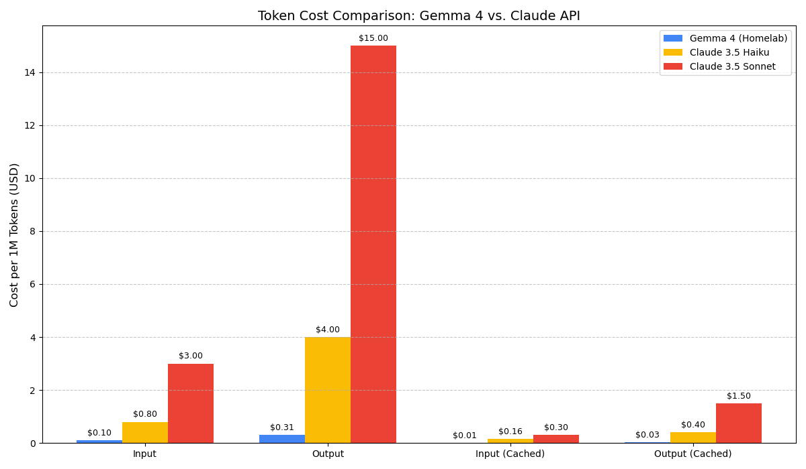
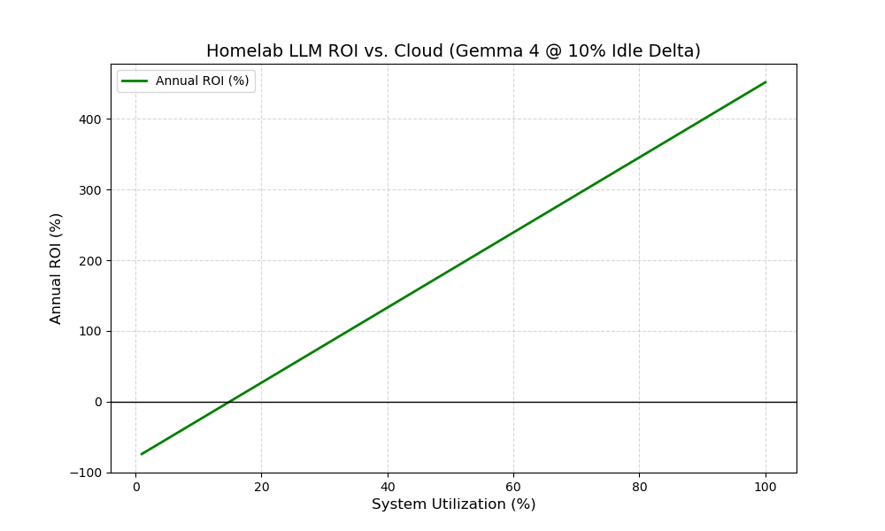

# LLM Cost Comparison

This report compares the Total Cost of Ownership (TCO) and Operational Expenditure (OPEX) of running a local **Gemma 4 (27B MoE)** instance on an NVIDIA RTX 3090 against the commercial API pricing of **Claude 3.5 Sonnet** and **Claude 3.5 Haiku**.

## 1. System & Assumptions

### **Local Infrastructure (Gemma 4)**

- **GPU**: NVIDIA GeForce RTX 3090 (Used, $780)
- **Other Hardware**: ~$300 (CPU, RAM, PSU, etc.)
- **Lifespan**: 3 Years
- **Electricity**: $0.38 / kWh
- **Power Profile**: 150W (Idle) / 500W (Load)
- **Performance**: ~219 tokens/s (Total)

### **Cloud API (Claude 3.5)**

- **Sonnet**: $3.00 (In) / $15.00 (Out) per 1M tokens.
- **Haiku**: $0.80 (In) / $4.00 (Out) per 1M tokens.

---

## 2. Cost Comparison (per 1M Tokens)

| Metric                  | Gemma 4 (Homelab) | Claude 3.5 Sonnet | Claude 3.5 Haiku |
| :---------------------- | :---------------- | :---------------- | :--------------- |
| **Input (Non-cached)**  | **$0.105**        | $3.00             | $0.80            |
| **Input (Cached)**      | **$0.011**        | $0.30             | $0.16            |
| **Output (Non-cached)** | **$0.314**        | $15.00            | $4.00            |
| **Output (Cached)**     | **$0.031**        | $1.50             | $0.40            |

---

## 3. Key Findings

### **Efficiency Gains**

- **vs. Claude 3.5 Sonnet**: The homelab setup is **~28x cheaper** for input tokens and **~48x cheaper** for output tokens.
- **vs. Claude 3.5 Haiku**: The homelab setup is **~7.6x cheaper** for input tokens and **~12.7x cheaper** for output tokens.

### **Hardware vs. OPEX**

The primary cost driver for the homelab is the electricity and hardware depreciation. Even with a conservative estimate of electricity at $0.38/kWh and a 10% system utilization, the cost per token remains significantly lower than any commercial API tier.

_Generated via Crush AI Assistant_
